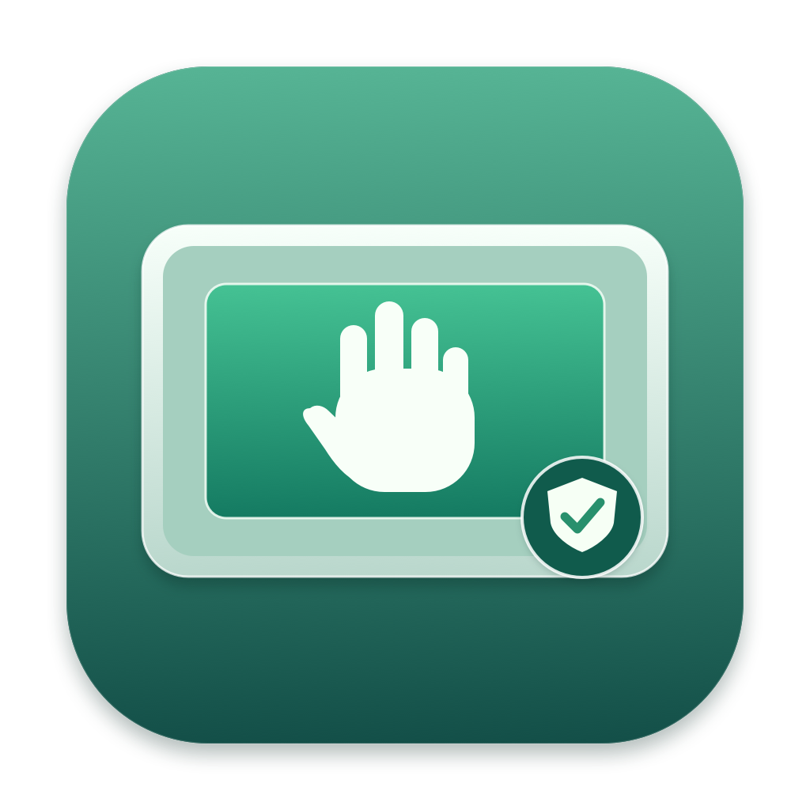

# Trackpad Edges



The app now removes edge contacts before Apple's native gesture recognizer. It opens the existing multitouch driver's private `FLTR` client and reinjects rewritten raw frames into the driver's ordinary stream. It installs no driver or service and keeps Apple's pointer and gesture engine.

Rejection has been confirmed in a hands-on trial; the full physical gesture matrix remains pending. App sessions have no time limit: click Start palm rejection and leave the app running until you stop it.

**Experimental and version-specific:** the validated environment is an Apple Silicon Mac running **macOS 15.7.5**, with a **Bluetooth Magic Trackpad family 129, driver type 4, parser type 1000 / Compact V7**. The filter refuses other macOS versions and unsupported trackpad protocols. Rebuilding alone does not add support for a different macOS version; the private interfaces and packet format need validation first.

## Build from source

### Prerequisites

- A Mac with Apple's Xcode Command Line Tools, including Swift 6 or later and Clang. Tested with Swift **6.2.3**. Full Xcode is not required.
- The compatible Mac/trackpad environment above to run native rejection.
- Git to clone the repository. There are no third-party package dependencies.

Install the Command Line Tools once if needed, then wait for installation to finish:

```sh
xcode-select --install
```

Check the Swift version, clone, test, and build:

```sh
swift --version
git clone https://github.com/KoichaDev/magic-trackpad-edge-rejection.git
cd magic-trackpad-edge-rejection
sh test.sh
sh build-app.sh
sh install-app.sh
open /Applications/TrackpadEdges.app
```

The build script creates a release executable, includes the app icon and bundle metadata, and signs `build/TrackpadEdges.app` with a local ad hoc signature. It also refreshes the bundle date and its macOS application registration so Finder picks up the icon after rebuilding. This is not an Apple Developer ID signature or notarization. The source repository excludes build outputs and local captures.

The install script copies the signed app into `/Applications`. If you prefer your personal Applications folder, use `sh install-app.sh "$HOME/Applications"` and open that copy. It refuses to replace an unrelated app or update an installed copy that is still running. When updating, it prints the temporary backup location of the previous app.

### Rebuild an existing checkout

Quit the running app before replacing its executable. From the repository directory:

```sh
sh test.sh
sh build-app.sh
sh install-app.sh
open /Applications/TrackpadEdges.app
```

All three scripts can be rerun after changing the code. If a cache contains paths from a moved checkout, run `swift package clean`, then repeat those commands. To regenerate the original icon after editing its drawing:

```sh
swift scripts/generate-app-icon.swift Assets
sh build-app.sh
```

Swift build caches are in `.build/`; the finished app is in `build/`. The generated iconset is ignored, while the PNG and ICNS used by the project are tracked.

## Use the app

1. Select the Bluetooth Magic Trackpad. The app starts **Stopped**, ready for you to activate protection manually. The main window shows the device, margins, canvas, and Start/Stop control. Diagnostics are collapsed under **Advanced**.
2. Adjust Left, Right, Top, and Bottom with the sliders, percentage fields, or by dragging the green center's edges and corner handles. All three controls stay in sync in 1% steps, with each margin limited to 0–45%. Press Return or leave a percentage field to finish editing; out-of-range numbers are clamped and invalid text restores the current value. All four margins save automatically and are restored when you reopen the app.
3. Click **Start palm rejection**. It stays active without a timeout while the app and selected device remain available. Test a center finger with an edge palm, crossings, clicks, scrolling, and gestures using [MANUAL-VERIFICATION.md](MANUAL-VERIFICATION.md).
4. Open **Settings…** with the gear button or **⌘,** and choose **Minimize to → Dock** or **Menu bar**. This preference saves automatically. **Minimize**, the yellow window button, and **⌘M** keep rejection running. The original Trackpad Edges icon stays in the menu bar in both modes, alongside **On**, **Off**, or another status label. Its menu includes **Show Trackpad Edges**, **Start/Stop palm rejection**, **Settings…**, and **Quit**. The Dock icon remains visible while the controls are open. Dock mode minimizes into the Dock; menu bar mode hides the Dock icon only when you hide/minimize the window. Showing the window restores the original Dock icon. Closing the window in menu bar mode also hides it; in Dock mode closing it quits. Reopening shows the controls; starting rejection still requires an explicit click.
5. The status distinguishes **Active**, **Stopped**, **Observing**, **Disconnected**, **Unavailable**, and **Error**. Reconnecting a device updates its availability while protection stays stopped. Dots show original contacts: red contacts are excluded from reinjected packets. **Advanced** contains counters for raw packets, rejected contact samples, and blocked physical click starts. Samples are not distinct fingers.
6. **Stop palm rejection**, local **⌘D**, or quit closes the filter client and restores ordinary input. The registered global **⌃⌥⌘D** shortcut still needs physical verification; use Stop palm rejection or local ⌘D during tests. Disconnect, sleep/session changes, or filter validation errors stop the session and require an explicit restart.
7. **Advanced → Export capture…** saves bounded JSON with contact diagnostics and filter counters. Captures contain device identity and touch positions; keep them local.
8. Click the version in the main window or choose **About Trackpad Edges…** to see the running app's version and build. **Settings → Application → Show app in Finder** reveals the actual app bundle, so you can distinguish an installed copy from an older build.

### Open at login

The first launch asks whether to open Trackpad Edges when you sign in to macOS. Choose **Open at Login** or **Not Now**; the question is shown once. You can change this later with **Settings → Startup → Open at login** or the menu bar item.

This uses Apple's `SMAppService.mainApp` login item, not a custom startup script or privileged helper. macOS opens the app after you sign in following a restart or shutdown. Saved margins and window-location settings restore normally; **palm rejection still requires pressing Start palm rejection**.

If macOS requires approval, the app shows **Approval needed** and a **Login Items…** button. Approve it in **System Settings → General → Login Items**; the app refreshes its state when you return. Registration failures show an error and retain the actual macOS state. You can also manage the item in System Settings.

Keep the app bundle in a permanent location while startup is enabled. Install with `sh install-app.sh` and open the Applications copy before enabling **Open at login**. If you move the app to another location, turn startup off in the old copy, open the new copy, and turn it back on. Deleting a registered app prevents it from opening at login.

In **Advanced**, enable **Observation only** to observe contacts without changing input. Enable **Record system input events** to add a passive Core Graphics observer, which requires Input Monitoring. Both options can be changed while stopped. They are off by default; raw rejection needs neither system event recording nor Core Graphics suppression or timing-based attribution. A sandbox may deny the private client with `kIOReturnNotPermitted`; launch the app normally. No root helper or private entitlement is added.

## Command line

```sh
.build/debug/TrackpadEdges --devices
.build/debug/TrackpadEdges --diagnostics
.build/debug/TrackpadEdges --probe 15 --contacts-only --reject-edges --output /tmp/rejection-test.json
.build/debug/TrackpadEdges --probe 15 --contacts-only --output /tmp/observation-test.json
```

Command-line probes last at most 60 seconds for their requested diagnostic duration; app sessions have no time limit. Use `--device ID` when multiple eligible trackpads exist.

## Implementation and verification

The custom icon is drawn locally with AppKit. Preview [Assets/AppIcon.png](Assets/AppIcon.png); its packaged macOS version is `Assets/AppIcon.icns`. The source drawing is `scripts/generate-app-icon.swift`.

`MultitouchAdapter.c` opens `MTDeviceStart(device, 0x40000000)` and verifies the driver's `FilterEnabled` property for this process. **Bit 30 is the filter flag; bit 31 opens an ordinary observer and must not be used for reinjection.**

`RawContactFilter.c` validates Compact V7 packets, decodes positions against the device's Sensor Surface Descriptor, removes edge records, and preserves center records. Reentry starts with make-touch to reset native history. Admitted liftoffs remain visible. Physical click starts require an active center contact; accepted presses retain their release. Force-stage indication is cleared for excluded input.

Unknown non-contact reports pass unchanged. Invalid touch packets switch immediately to passthrough, followed by session shutdown. Reinjection errors, disconnect, sleep, session changes, and optional event-tap failures stop the session. Normal teardown sends an empty button-release frame to the selected native stream before closing its filter client.

Packet tests cover mixed contacts, all edges, crossings, button lifecycle, malformed packets, immutability, and timestamp preservation under address/undefined-behavior sanitizers. These checks do not replace physical acceptance. See [CAPABILITIES.md](CAPABILITIES.md); the [original observer report](CAPABILITIES-OBSERVATION.md) records the previous app's unsuccessful filtering approach.

No Core Graphics event is dropped: `EventSample.suppressed` stays false. Native filtering is reported separately in capture format 2.

## Sources

- Installed macOS 15.7.5 MultitouchSupport and AppleMultitouchDriver symbol/disassembly inspection: filter client, raw routing, injection, Compact V7 parser, and coordinate transform.
- [Linux Magic Trackpad decoder](https://github.com/torvalds/linux/blob/master/drivers/hid/hid-magicmouse.c): independent reference for Bluetooth report 0x31 and nine-byte contact packing. This decoder is independently implemented and checked against Apple's callbacks.
- [Apple HID client header](https://github.com/apple-oss-distributions/IOHIDFamily/blob/main/HID/Headers/HIDEventSystemClient.h): system event-filter callbacks require a private entitlement. This app uses the multitouch driver's separate raw-client path.

- [Apple SMAppService.mainApp](https://developer.apple.com/documentation/servicemanagement/smappservice/mainapp): native main-app launch at login.
